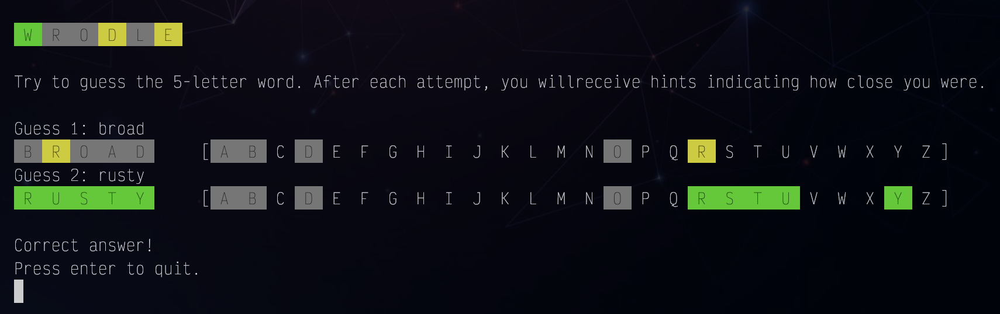

# Wrodle – a wordle-like game for CLI

A very simple command line wordle-like word guessing game made with C3.

On every run it picks a random word from `wordlist.txt`.



## Usage

```sh
c3c build
./build/wrodle
```

or simply `c3c run`

